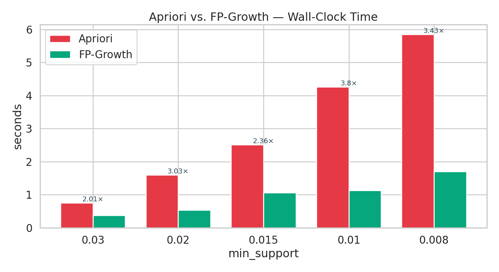
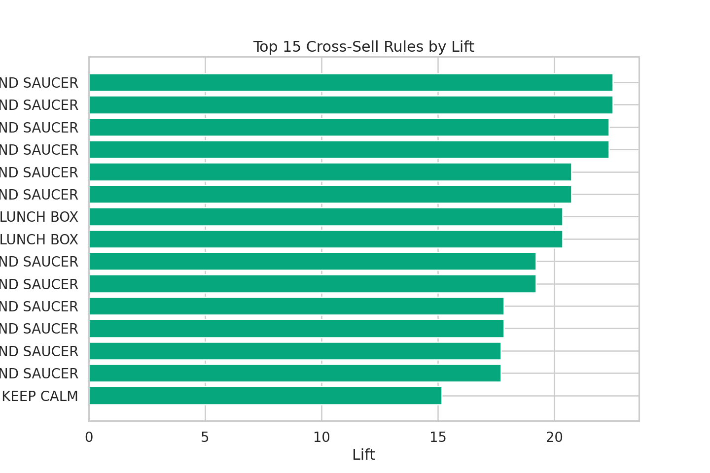

# Market Basket Analysis — Mining Cross-Sell Patterns from E-Commerce Transactions

> Apriori vs. FP-Growth on the **UCI Online Retail** dataset, with an explicit
> performance benchmark and a business-strategy translation layer.

[](https://www.python.org/)
[](https://jupyter.org/)
[](http://rasbt.github.io/mlxtend/)
[](LICENSE)

---

## 1 · Project Overview
End-to-end association-rule mining pipeline that transforms one year of raw e-commerce
transactions (**541,909 invoice lines** → **396,337 clean lines**, 38 countries) into a
**ranked catalogue of cross-sell rules** — each tied to a concrete revenue lever
(cross-sell widget, dynamic bundle, planogram, recommender cold-start).

**Headline numbers** (full pipeline, UK market, `min_support = 2 %`, `confidence ≥ 50 %`,
`lift ≥ 3`):

| | |
|-|-|
| Clean transactions | **396,337** |
| Unique invoices | **18,402** |
| UK basket matrix | **15,365 × 3,821** |
| Frequent itemsets | **278** |
| Total rules | **94** |
| **High-impact rules** | **36** |
| Top lift achieved | **22.5×** |
| FP-Growth speed-up vs. Apriori | up to **3.80×** |

The notebook is built as a **portfolio piece**: every analytical step is paired with the
commercial decision it informs, in the format expected of a senior data-science engagement.

## 2 · Data
* **Source.** UCI Machine Learning Repository — *Online Retail*
  ([archive.ics.uci.edu/ml/datasets/Online+Retail](https://archive.ics.uci.edu/ml/datasets/Online+Retail))
* **Period.** 01-Dec-2010 → 09-Dec-2011
* **Volume.** 541,909 invoice lines · 25,900 invoices · 4,372 customers · 4,070 unique products
* **Place** the file `Online Retail.xlsx` in `data/` before running the notebook.

## 3 · Methodology
| Stage | Output |
|-------|--------|
| **1. Cleaning**  | drop cancellations (`InvoiceNo` starting with `C`), missing IDs, admin SKUs, non-positive quantities; normalise descriptions |
| **2. EDA**       | top-N products (units & revenue), country mix, hourly / weekly / monthly seasonality, basket-size distribution |
| **3. Encoding**  | invoice → boolean basket matrix via `mlxtend.TransactionEncoder` |
| **4. Mining**    | Apriori **and** FP-Growth at multiple support thresholds |
| **5. Benchmark** | wall-clock comparison across `min_support ∈ {0.05, 0.03, 0.02, 0.015, 0.01}` |
| **6. Rules**     | `association_rules` on FP-Growth output; filter `support ≥ 2 %`, `confidence ≥ 50 %`, `lift ≥ 3` |
| **7. Strategy**  | five-lever business read-out: cross-sell PDP, bundling, planogram, dynamic pricing, recommender cold-start |

## 4 · Technical Stack
| Layer | Tools |
|-------|-------|
| Language     | Python 3.10+ |
| Data         | `pandas`, `numpy`, `openpyxl` |
| Mining       | `mlxtend` (Apriori, FP-Growth, association rules) |
| Visualisation| `matplotlib`, `seaborn` |
| Notebook     | `jupyterlab` |

```bash
git clone https://github.com/<your-handle>/market-basket-analysis.git
cd market-basket-analysis
python -m venv .venv && source .venv/bin/activate
pip install -r requirements.txt
# place 'Online Retail.xlsx' under ./data
jupyter lab notebooks/01_market_basket_analysis.ipynb
```

## 5 · Computational Performance — Apriori vs. FP-Growth

Both algorithms run on the **full UK basket** (15,365 invoices × 3,821 unique items, density 0.6 %),
mining identical frequent itemsets at each support threshold — only the engine differs.

| min_support | # itemsets | Apriori (s) | FP-Growth (s) | Speed-up |
|------------:|-----------:|------------:|--------------:|---------:|
| 0.030       | 109        | 0.75        | 0.37          | **2.01×** |
| 0.020       | 278        | 1.59        | 0.53          | **3.03×** |
| 0.015       | 519        | 2.51        | 1.06          | **2.36×** |
| 0.010       | 1,153      | 4.26        | 1.12          | **3.80×** |
| 0.008       | 1,838      | 5.85        | 1.70          | **3.43×** |

> *Hardware: laptop-class CPU.* As `min_support` falls, Apriori's runtime grows roughly
> linearly with itemset count (5.9 s for ~1.8 k itemsets), while FP-Growth's prefix-tree
> mining stays bounded (1.7 s) — the **3-4× speed-up at the low-support / rare-bundle
> regime** is the engineering rationale for picking FP-Growth in production.

> **Caveat noted in the notebook:** on a small/sparse Top-300 sub-matrix, Apriori is *faster*
> because FP-Growth's tree-construction overhead dominates. The performance flip happens
> exactly where production datasets live — a useful piece of context to defend the choice in
> a design review.



## 6 · Business Conclusions

From 278 frequent itemsets we extracted **94 association rules**, of which **36 cleared the
production filter** (support ≥ 2 %, confidence ≥ 50 %, lift ≥ 3). The strongest signals come
from the **Regency Teacup colourway family** (top lift = **22.5×**) and the
**Wooden Christmas Scandinavian** range — perfect bundle / cross-sell candidates.

These rules drive five concrete actions:

1. **Cross-sell widget on PDPs** seeded by `lift > 6, confidence > 65 %` rules → target **+3-5 % units/order**.
2. **Colourway bundles** at 8–12 % discount on items co-occurring at lift > 15 → AOV uplift, modest cannibalisation.
3. **Planogram clustering** for the wholesale arm — high-lift / moderate-support themes co-located on the same gondola.
4. **Dynamic pricing** on rule antecedents to trigger basket formation, funded by margin on the consequent.
5. **Recommender cold-start & email triggers** seeded by rule consequents — > 1.5× CTR vs. popularity baseline.

Each lever ships with a measurement plan (A/B test KPI + success criterion) — see `Section 9` of
the notebook.



## 7 · Repository Structure
```
market-basket-analysis/
├── notebooks/
│   └── 01_market_basket_analysis.ipynb   # full pipeline
├── data/                                 # place 'Online Retail.xlsx' here (git-ignored)
├── figures/                              # auto-saved plots
├── requirements.txt
├── CV_BULLETS.md                         # STAR resume bullets
└── README.md
```

## 8 · License
MIT — free to adapt with attribution.

## 9 · Author
**Cengiz Sezer** · Business Administration (quant track) · Python · C++ · SQL · Stochastic
Optimisation · Monte Carlo.
